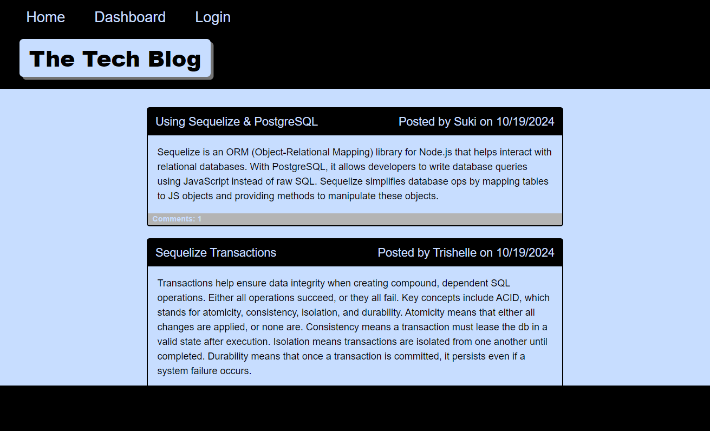
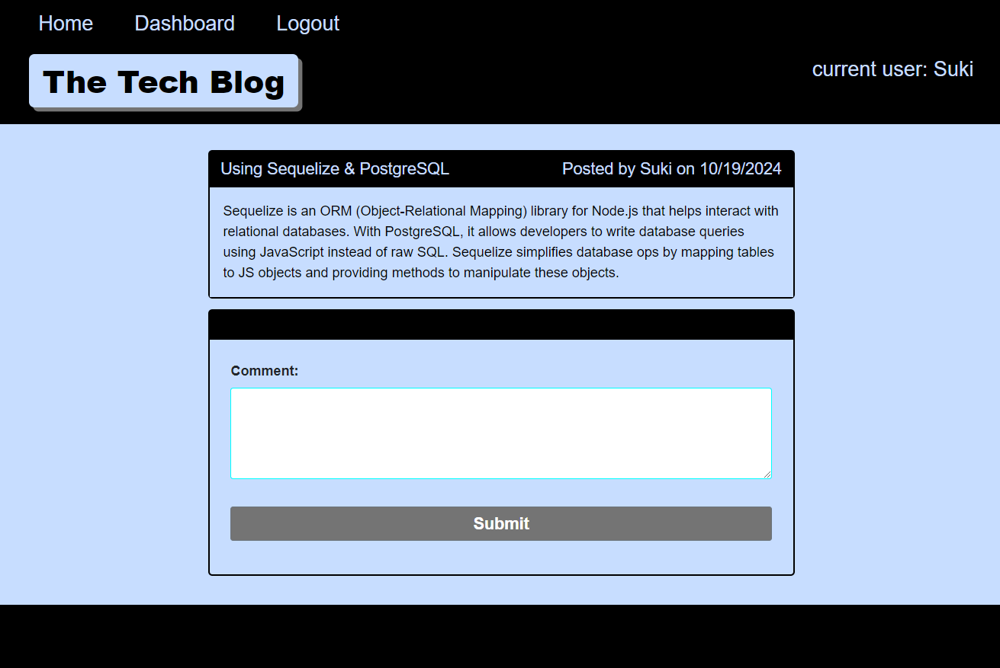
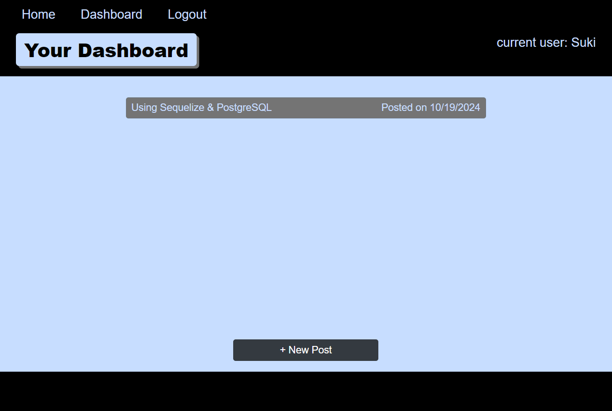
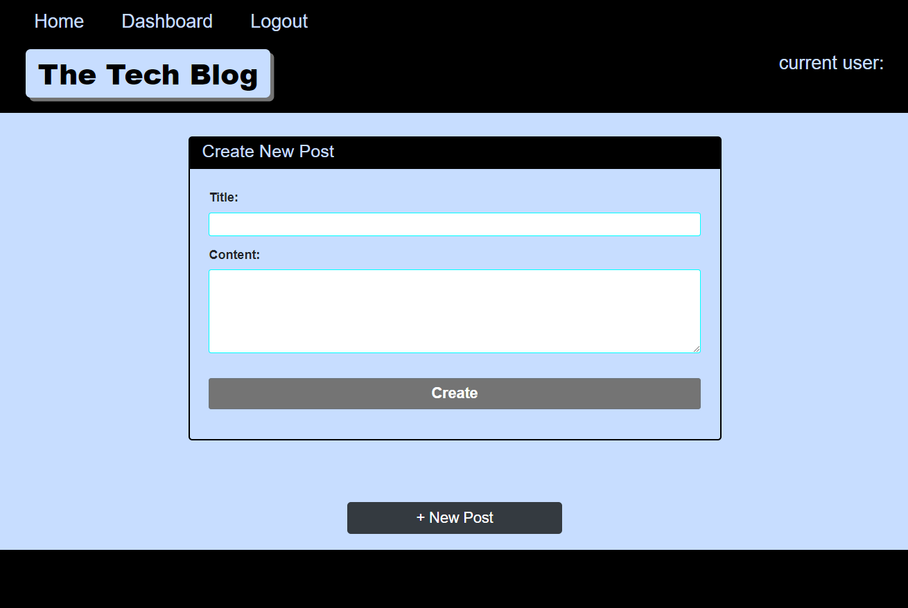
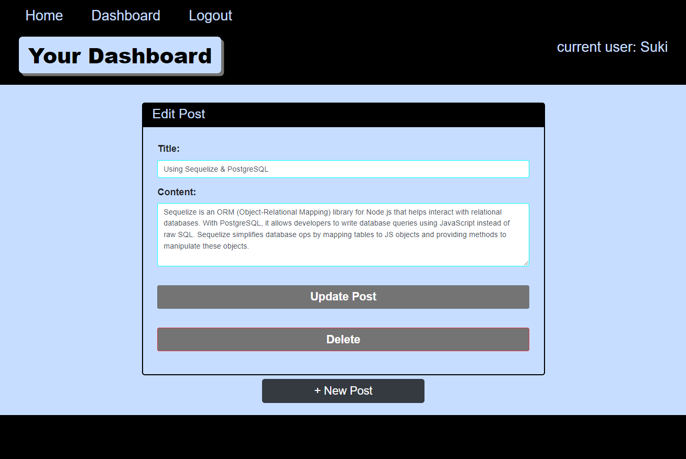

# 14c-MVC-Tech-Blog

## Table Of Contents

- [Description](#description)
- [Technologies Used](#technologiesused)
- [Key Features](#keyfeatures)
- [Installation](#installation)
- [Usage](#usage)
- [Credits](#credits)
- [License](#license)

## Description

Writing about tech is just as important as learning and utilizing tech. Developers at all levels depend on technical documentation to understand new concepts, debug code, and share their experiences.

The Tech Blog is a CMS-style blog site where developers, both new and experienced, can publish blog posts about tech topics of interest to them. They can also comment on other user's posts. 

This app was build from scratch using the MVC paradigm, Handlebars.js templating, Sequelize as the ORM, and the express-session npm package for authentication.

## Technologies Used

-- MVC file structure
-- Node.js
-- Express JS
-- PostgresSQL
-- Sequelize ORM
-- HTML
-- CSS, Bootstrap CSS
-- Javascript, Handlebars JS

## Key Features

The Tech Blog homepage displays all the blog posts from all users. In order to view the comments associated with a post, post a new comment, or view the dashboard, the user must log in or sign up. Once logged in, users can also create new posts, update one of their posts (listed on their dashboard), or delete a post from their dashboard.

## Installation

This app uses a fully functional Express.js API that integrates Sequelize with PostgreSQL database. In order to use this app locally, the user must install Node.js and PostgreSQL. Alternatively, you can use the Render link below to launch the app.

Render deployment:
https://one4c-mvc-tech-blog.onrender.com

GitHub Repository:
https://github.com/qbres333/14c-MVC-Tech-Blog

## Usage

To use the app locally, the user can do the following:
    -- right click on 'db' folder and open in the terminal
    -- enter 'psql -U postgres', then password
    -- type '\i schema.sql' and press ENTER
    -- right click on 'server.js' file and open in the terminal
    -- run the following commands sequentially: npm i, npm run seed, node server.js
    -- In your browser, go to the URL 'localhost:3001' and enjoy!

## Credits

CSS overflow:
https://developer.mozilla.org/en-US/docs/Web/CSS/overflow
https://developer.mozilla.org/en-US/docs/Web/CSS/text-overflow

Bootstrap:
https://getbootstrap.com/docs/5.0/getting-started/introduction/

Toggle Password Visibility:
https://www.w3schools.com/howto/howto_js_toggle_password.asp

JavaScript dataset property:
https://developer.mozilla.org/en-US/docs/Web/API/HTMLElement/dataset

Handlebars.js:
https://handlebarsjs.com/guide/

Express Routing:
https://expressjs.com/en/guide/routing.html

URL handling for login/signup (withAuth.js):
https://www.geeksforgeeks.org/express-js-req-originalurl-property/

## License

MIT License - see the LICENSE file for details.